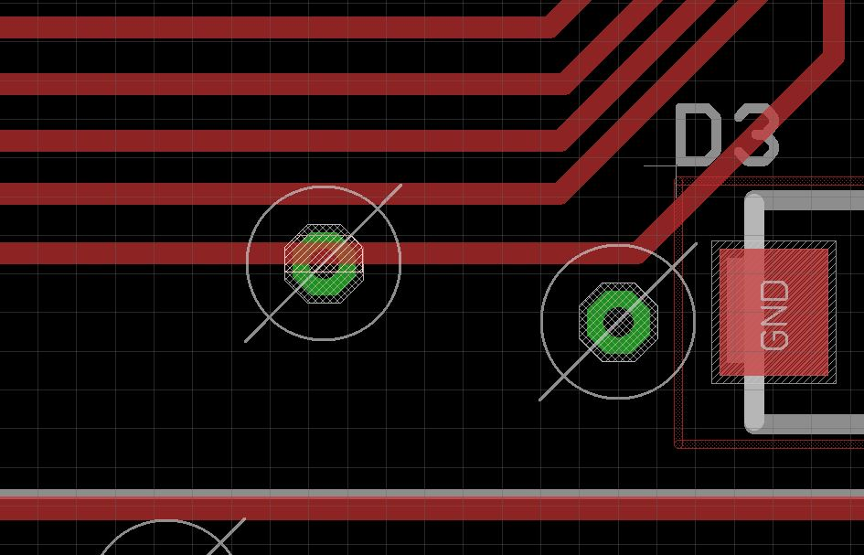
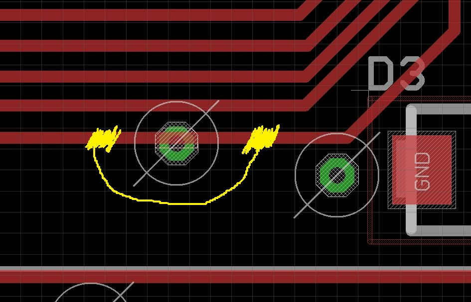

### _Series info_

_I have been working as an embedded enginner since 2016. I started with a very little knowledge but thanks to Google and internet community I was able to complete several projects that are being used daily by thousands of people. Behind every success there is usually some failures and in my case, well, I did messed up a lot of stuff! It is time to bring the past mistakes back to life and share them! I would like to make people feel less self-conscious about their own mistakes, potentially make people laugh and help begginers to lear (how not to do stuff). Also english is not my mother tongue so bear with me._

Disclaimer: Some details may or may not be changed as some of the projects and information may or may not be confidential.

# What happened?

So we were working on this quite important project. The goal was to build a prototype for a trade show. That means NO delays allowed. And we were on the roll! Mechanical construction was ready to go, my PCB and programm as well, marketing was doing good... We had time to spare! It was actually getting quite suspicious...

And then it came. Due to last minutes changes that were not discussed with the rest of the team, my PCB did not fit inside the enclosure. So on Monday I have got a new task - deliver a PCB that will fit and work until Friday 1 pm. Little did I know, the whole time there would be a group of people breathing on my neck and constantly asking if I am done already.

## Re-design

It was ca. 15x10 cm (6x4inch) 2-layer PCB with STM32F0 in 32-pin package and bunch of SMD 0603 components + several terminal blocks, AC/DC supply and large joystick placed in the middle. I had to resize it, move the joystick and mounting holes to a new position (I had to move a lof stuff around). I managed to do just that in about 9 hours and I ordered it express on the same day (3 days shipping - you can't really get it faster where I live).

## Assembly + testing

It arrived on Thursday after lunch. Luckily I had all parts needed and I had enough time to adjust the SW (I had to move some peripherals like I2C on the MCU). It took me 2 hours (I am really good at speed soldering) to assemble it and I tested all functionally. Well, almost all. I skipped **one** because I was pretty confident about it (it was one of the PCB areas that I barely touched). Also, it would had to be connected to 230 AC. As this project was still in prototype phase there was no "testing mounting device" and I was not interested in getting shocked that afternoon.

## Terrible discovery

So the PCB was build in, we started the device and... you guess it. The **one** function was not working properly. I checked with my multimeter and instead off any kind of the signal, it was connected straight to GND (0.1 Ohm).

Then I checked the Eagle files and got instant chills down to my spine.

This is what I have done. A ground via was overlapping with my signal trace. You can actually see the Eagle trying to warn me and of course, the Eagle ERC/DRC check would tell me this right away. I just _did not_ have time to run it.

## Solution?

Unfortunately I do not have an actual picture of the glorious repair work (if you keep following the series I have some nasty photos up my sleave!). I have scratched the solder mask on yellow marked placed and bridged the "problematic area" with thin reparatur wire (personally I love [this one](https://www.amazon.com/Colored-Insulation-B-30-1000-8-Wire-Wrapping/dp/B07BLZ333V)). It worked, it was delivered on time and it did not malfunctioned during the trade show. But I felt like \*\*\* weeks after that. I would accept some "normal" mistake (at this point I have learned how to) but this hit me hard.

## What lead to this disaster?

- I accepted this crazy last minute change (well I had to choice)
- I did not run the basic checks (run the frigging Eagle checks every time for duck sake!)
- No one checked my work (to be fair, at the time I was the only person taking care about this stuff)
- I did not test all the functionally before handing it over to production
- I did not accepted the mistake for a very long time. I let it hurt my "ego" and make me feel miserable.

## What have I learned?

It is always the **one** time.

- The **one** time the change in project was not discussed.
- The **one** time I did not run DRC Eagle check.
- The **one** functionality I did not test.

Avoid those.
